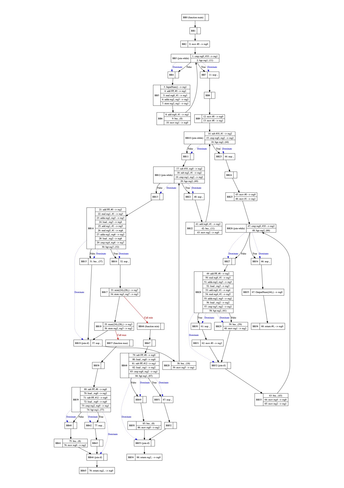

# SMPL Compiler
Optimizing compiler for the small and simple programming language `smpl`. You can find EBNF [here](./SMPL%20EBNF.pdf) for the language specifics. Lexer is implemeted to support a recursive descent parser that parses the language into a dynamic datas structure. Then, it is converted to SSA-based intermediate representation (IR) with copy propagation and common subespression elimination. Design choices which are specified in the [design document](./design_document.pdf) are strictly followed.

The compiler supports following features:
1. Incomplete dead code elimination
   1. Unexecuted if/while statement
   2. Unused variables
   3. Uncalled functions
2. Constant folding
3. Copy propagation
4. Common subexpression elimination
5. Coverting to SSA-based IR
6. Graph representation of IR

## Architecture
~~Strikethrough~~ components are not implemented.


## Run
* Setup Python environment
```shellscript
$ pipenv install
```
* Compile
```shellscript
$ pipenv run -- python3 src/main.py -g {input file} {output dir}
```
You can see graph view of a generated IR in `output dir`.

## Demonstration with bubble sort
__SMPL code__
```
main
array[10] arr;
var i, length;
var j;
var result;

function min(element1, element2);
var tmp;
{
    let tmp <- 0;
    if element1 > element2
    then let tmp <- element2
    else let tmp <- element1
    fi;

    return tmp;
};

function max(element1, element2);
var tmp;
{
    let tmp <- 0;
    if element1 > element2
    then let tmp <- element1
    else let tmp <- element2
    fi;

    return tmp;
};

{
    let length <- 10;
    let i <- 0;
    while i < 10 do 
        let arr[i] <- call InputNum();
        let i <- i + 1
    od;

    let i <- 0;
    let j <- 0;
    while i < (length - 1) do
        while j < (length - i - 1) do
            if arr[j] > arr[j + 1]
            then 
                let arr[j] <- call min(arr[j], arr[j + 1]);
                let arr[j + 1] <- call max(arr[j], arr[j + 1]);
            fi;
            let j <- j + 1;
        od;
        let i <- i + 1;
    od;

    let i <- 0;
    let result <- 1;
    while i < 10 do
        if arr[i] > arr[i + 1]
        then let result <- 0
        fi;
        let i <- i + 1;
    od;
    
    call OutputNum(result);

    return 0;
}.

```
__IR__

__Register Allocated IR__

## Trivia
I implemented it all by myself from the scratch with great help from professor [Michael Franz](https://www.michaelfranz.com/)'s Compiler lectures.

Total time spent:
> Writing design document - 5 days \
> Coding - 3 days


